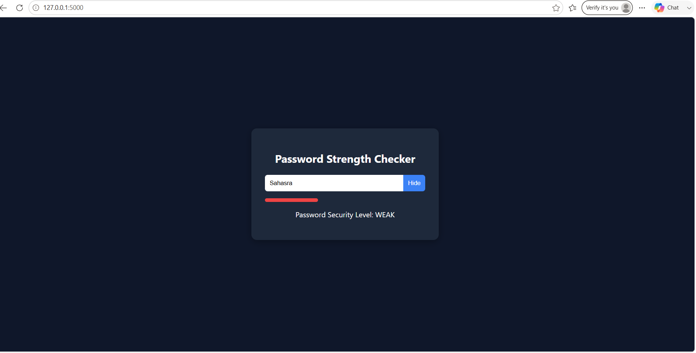
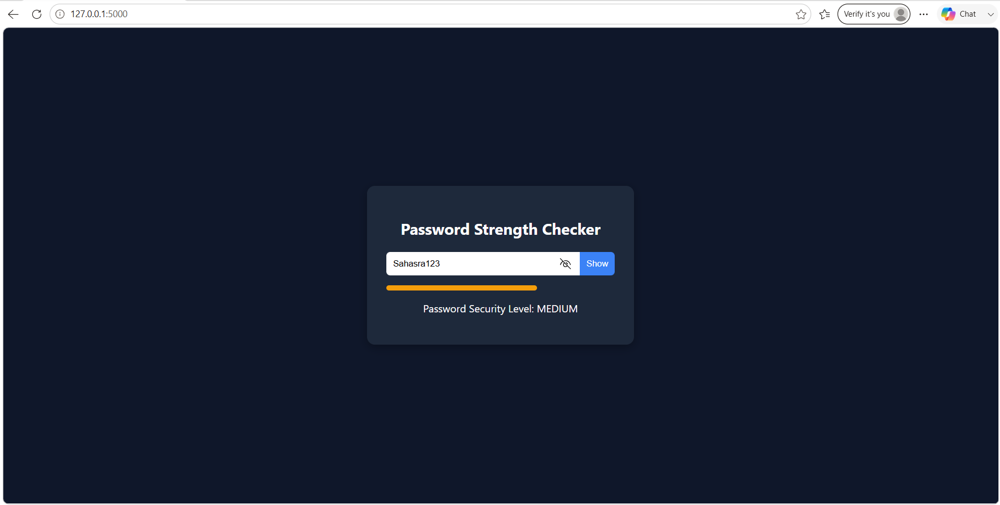
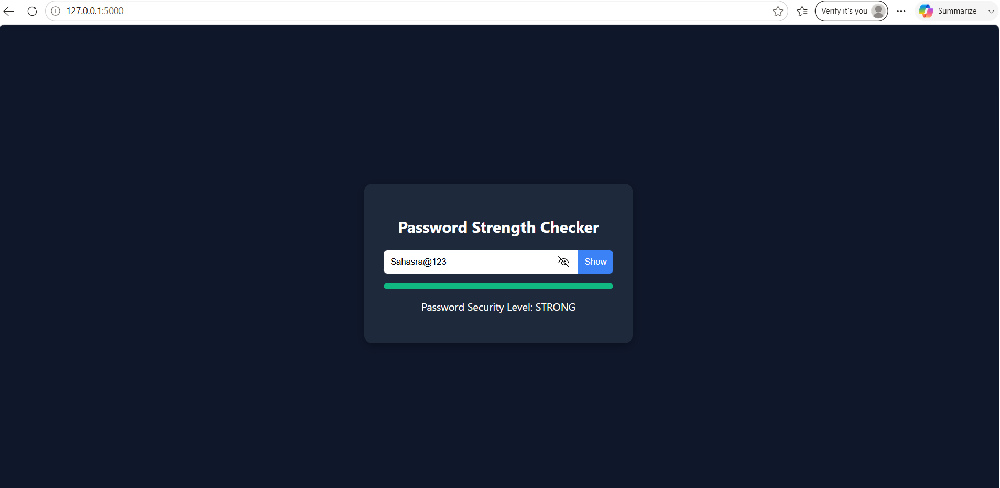

# Password Strength Checker Project

## Intern Details
* **Name:** Dhadi Sahasra
* **Intern ID:** CITS2671
* **Organization:** CodeTech IT Solutions

## Project Overview
This project is a comprehensive Password Strength Checker application built using Python and Flask. It processes input strings dynamically across complex heuristic rules (character classification arrays, entropy limits, and lengths) to return immediate defensive ratings alongside optimization lists to the user interface.

## Features
* Multi-tier validation algorithm (Length, Case complexity, Integers, Special characters)
* Intuitive UI color-coded response tracking metrics
* Real-time text mask toggle (Hide/Show password strings)
* Comprehensive remediation generation lists
* Production ready isolated architecture

## Technologies Used
* Python
* Flask
* HTML
* CSS
* JavaScript

## Dashboard Screenshots

<table>
  <tr>
    <td align="center"><strong>Weak Password State</strong></td>
    <td align="center"><strong>Medium Password State</strong></td>
    <td align="center"><strong>Strong Password State</strong></td>
  </tr>
  <tr>
    <td></td>
    <td></td>
    <td></td>
  </tr>
</table>

## How to Run
1. Clone the repository.
2. Install Flask:
   ```bash
   pip install flask
 ```

3. Run the application:

```bash
python app.py
```

4. Open your browser and visit:

```
http://127.0.0.1:5000
```

## Project Structure

```text
password-strength-checker/
│
├── app.py
├── templates/
│   └── index.html
├── static/
│   ├── style.css
│   ├── script.js
│   └── images/
│       ├── weak.png
│       ├── medium.png
│       └── strong.png
└── README.md
```  
